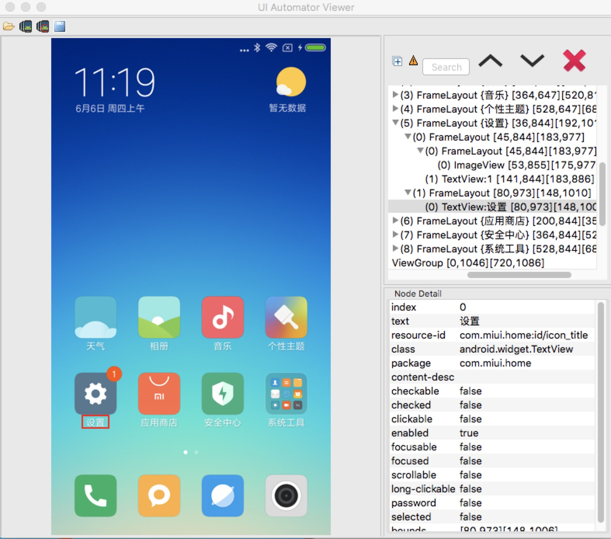

# [](https://travis-ci.com/ZhonganTechQA/za-Farmer)
# za-Farmer
 
za-Farmer 是一个基于Uiautomator2.0 的命令行自动化工具，你可以通过命令行驱动Uiautomator进行Android自动化测试。

我们封装了Android大部分常用操作，你可以很容易的使用它实现你的Android自动化需求。

它可以帮你自动处理权限弹窗，并配套有完整的执行日志和过程截图，帮助你还原执行过程中的情况。

## 内容列表
- [特性](#特性 )
- [构建](#构建 )
- [安装](#安装 )
- [简单示例](#简单示例 )
- [步骤介绍](./markdown/stepIntroduce.md)


## 特性
### 1、步骤执行自动截图
执行过程中每个步骤都会截图记录操作的元素或标注执行轨迹

 
<br/>

### 2、权限弹框自动处理
对于应用程序弹出的权限弹框进行自动处理<br/>
<br/>


## 构建

```bash
git clone https://github.com/ZhonganTechQA/za-Farmer.git
cd ./za-Farmer
./gradlew clean assembleAndroidTest assembleDebug
```
成功后生成两个apk

/Farmer_new/app/build/outputs/apk/androidTest/debug/app-debug-androidTest.apk

/Farmer_new/app/build/outputs/apk/debug/app-debug.apk

## 安装

- 安卓5.0以下安装方式:

```bash
adb install  /Farmer_new/app/build/outputs/apk/androidTest/debug/app-debug-androidTest.apk
```
```bash
adb install  /Farmer_new/app/build/outputs/apk/debug
```
- 安卓5.0以上安装方式:

```bash
adb install -g /Farmer_new/app/build/outputs/apk/androidTest/debug/app-debug-androidTest.apk
```
```bash
adb install -g /Farmer_new/app/build/outputs/apk/debug
```
#### 注意:-g 参数为授予所有运行权限，安卓5.0以下不支持


## 简单示例
#### 点击“设置”
<br/>
```bash
$ adb shell am instrument -w  -e class 'com.smart.farmer.ExampleInstrumentedTest#step'  \
 -e step-action click \
 -e step-elementText 设置  \
 com.smart.farmer.test/android.support.test.runner.AndroidJUnitRunner
```
#### 执行完成后导出过程截图
```bash
$ adb pull /storage/emulated/0/Android/data/com.smart.farmer/cache/  ./Desktop/
```

<br/>
